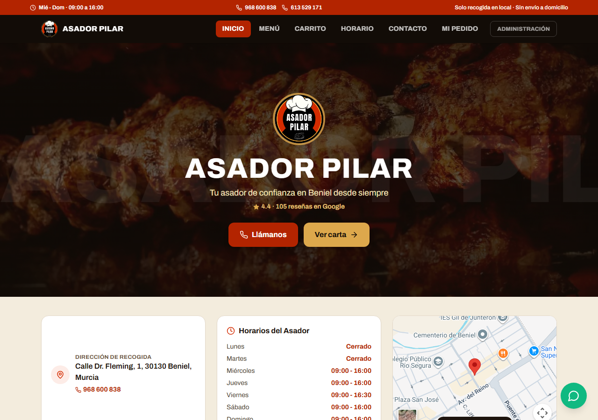
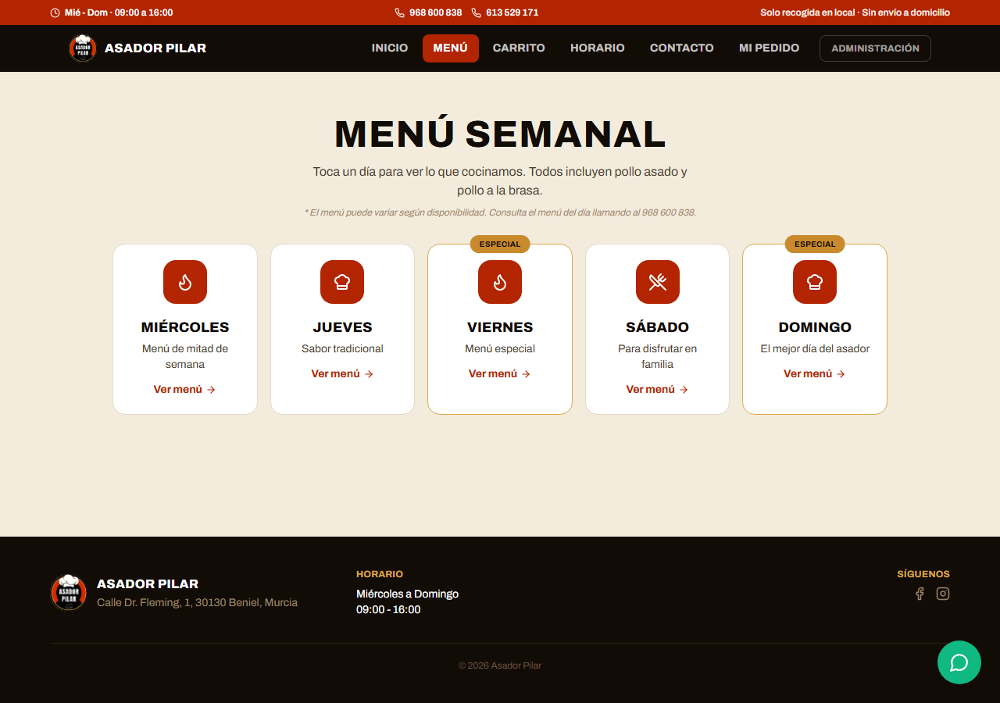
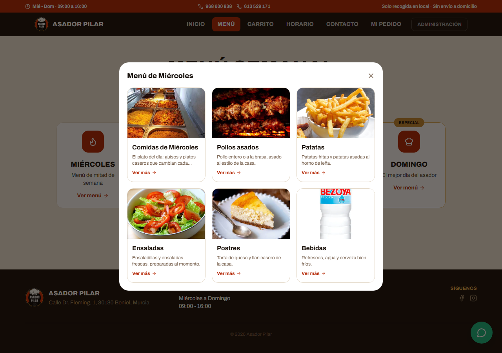

# Asador Pilar

Aplicación web completa de pedidos para recoger en tienda, construida para un asador real en
Beniel (Murcia). Los clientes hacen su pedido online sin necesidad de cuenta, y el negocio lo
gestiona todo desde un panel de administración con acceso restringido a gerentes.

**[ Ver demo en vivo](https://asador-pilar.vercel.app)**



## Funcionalidades

### Cara al cliente

- **Carta organizada por días**: el "menú del día" (Comidas) rota de miércoles a domingo según la
  carta real del negocio; el resto de categorías (pollos, patatas, ensaladas, postres, bebidas)
  están disponibles todos los días.
- **Carrito y checkout** sin necesidad de crear cuenta, con selección de hora de recogida según
  franjas con aforo limitado.
- **Confirmación de pedido** con número de pedido, resumen y hora de recogida.
- **Email automático de confirmación** al hacer el pedido (Supabase Edge Function + Resend).
- **Recordatorio por WhatsApp** de un clic con los datos del pedido.
- **"Mi Pedido"**: cualquier cliente puede consultar y anular su propio pedido (número de pedido +
  teléfono), y el stock se repone automáticamente al cancelar.
- **Formulario de contacto** que llega directamente al panel de administración.
- Diseño responsive, con paleta y tipografía de marca propia.



### Panel de administración (acceso solo para gerentes)

- **Autenticación real** con Supabase Auth + control de rol (`gerente` / `empleado`) vía RLS —
  solo los usuarios marcados como gerente pueden entrar.
- **Gestión de pedidos**: filtros por estado y origen; los pedidos entregados o cancelados se
  ocultan del listado activo automáticamente.
- **Gestión de productos** (alta, edición, baja) y **control de stock** con historial de
  movimientos (ventas, entradas, ajustes, cancelaciones).
- **Horarios y franjas de recogida** configurables.
- **Estadísticas de ventas** (canal, productos más vendidos, evolución).
- **Bandeja de mensajes de contacto**.
- El descuento/reposición de stock al hacer o cancelar un pedido ocurre de forma atómica en el
  servidor (funciones PL/pgSQL), no en el cliente.



## Stack técnico

| Capa | Tecnología |
|---|---|
| Frontend | React 18 · TypeScript · Vite · React Router · Tailwind CSS |
| Backend | Supabase (PostgreSQL, Auth, Row Level Security, funciones PL/pgSQL, Edge Functions) |
| Email transaccional | Resend, invocado desde una Supabase Edge Function |
| Gráficos admin | Recharts |
| Iconos | lucide-react |

**Por qué esta arquitectura**: es una SPA sin servidor propio — toda la lógica de negocio sensible
(descuento de stock, cancelaciones, permisos por rol) vive en Postgres como funciones
`security definer`, no en el cliente. Así un usuario anónimo puede "hacer un pedido" sin tener
acceso de escritura directo a las tablas, y los datos quedan compartidos entre dispositivos en
lugar de vivir en el `localStorage` de cada navegador.

## Estructura del proyecto

```
src/
  types/            Tipos TypeScript del dominio (Producto, Pedido, Horario...)
  lib/              Cliente de Supabase + mapeadores fila↔tipo (snake_case ↔ camelCase)
  state/            AppContext (datos compartidos vía Supabase) y AdminAuthContext (sesión/rol)
  utils/            Formateo de precios, fechas, horarios y estados
  layouts/          ClientLayout (tienda) y AdminLayout (panel de administración)
  components/
    client/         Navegación, footer, carrito flotante, botón de WhatsApp...
    admin/          Sidebar, guard de rutas (RequireAdminAuth), tarjetas de estado...
  pages/
    client/         Inicio, Menú, Carrito, Checkout, Confirmación, Mi Pedido, Contacto, Horario
    admin/          Login, Dashboard, Pedidos, Productos, Stock, Horarios, Ventas, Mensajes...
supabase/
  *.sql             Migraciones SQL (tablas, RLS, funciones) — ejecutar en orden en el SQL Editor
  functions/        Edge Functions (envío de email de confirmación)
```

## Cómo ejecutarlo en local

Requisitos: Node.js 18+ y un proyecto de [Supabase](https://supabase.com) (gratuito).

```bash
npm install
cp .env.example .env   # y rellena tus claves de Supabase
npm run dev
```

### Base de datos

Ejecuta estos archivos, **en este orden**, en el **SQL Editor** de tu proyecto de Supabase:

1. `supabase/setup.sql` — perfiles de usuario y rol (`gerente` / `empleado`).
2. `supabase/orders_and_catalog.sql` — productos, pedidos, stock, horarios, franjas y las
   funciones `place_order` / `set_order_status` (descuentan y reponen stock de forma atómica).
3. `supabase/seed_from_mockdata.sql` — siembra inicial de la carta, horarios y datos del negocio.
4. `supabase/contact_messages.sql` — formulario de contacto.
5. `supabase/cancel_order.sql` y `supabase/get_order_by_customer.sql` — que un cliente pueda
   consultar y anular su propio pedido.
6. `supabase/add_order_email.sql` — añade el email del cliente al pedido.
7. `supabase/update_comidas_menu.sql`, `supabase/update_postres_menu.sql`,
   `supabase/add_comidas_photos.sql`, `supabase/add_more_photos.sql`,
   `supabase/add_postres_photos.sql` — ajustes de contenido de la carta real y sus fotos.

La Edge Function de `supabase/functions/send-order-email` se despliega desde el panel de
**Edge Functions** de Supabase (necesita la variable de entorno `RESEND_API_KEY` de
[Resend](https://resend.com)).

```bash
npm run build      # build de producción
npm run preview    # previsualizar el build
```

## Licencia

MIT
